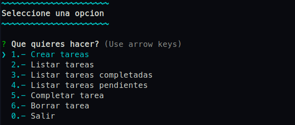

# Todo-list 

## Index 
1. [Install](#id1)
2. [Run](#id2)
3. [About me](#id3)
4. [Screenshoot](#id4)
5. [Built with](#id5)

## Install
- npm install

_This project use a few node modules, like:_

 colors
 inquirer

## Run 
to run this project use "node app.js"

## About me 
this project was developed by Samuel Narciso

[Repository](https://github.com/SamuelNarciso/todo-list-consola )

[Github](https://github.com/SamuelNarciso)

[Instagram](https://www.instagram.com/samuel_narciso)

## Screenshot 

## Built with 
**Node package modules**
    
- [Inquirer](https://www.npmjs.com/package/inquirer)
- [UUID](https://www.npmjs.com/package/uuid)
- [Colors](https://www.npmjs.com/package/colors)

**Javascript**    
